# SnapThème

## Description du jeu

SnapThème est un mini-jeu multijoueur mobile pensé pour plusieurs joueurs connectés en temps réel via Firestore.

Le principe est simple :

1. Un hôte crée une salle et partage un code à 6 caractères.
2. Les joueurs rejoignent la room depuis l’écran de lobby.
3. À chaque manche, un joueur est désigné comme “choosen” (le joueur qui choisit le thème).
4. Le thème est affiché à toute la table.
5. Les autres joueurs doivent envoyer une photo liée au thème, soit via la caméra, soit via la galerie.
6. Si la permission caméra est refusée, l’application permet de continuer en choisissant une image dans la galerie ou en devenant spectateur.
7. Une fois les photos soumises, la phase de vote démarre.
8. Les joueurs votent pour la photo qu’ils préfèrent.
9. Le score est calculé selon le nombre de votes reçus.
10. Le host peut passer à la manche suivante, ou revenir au lobby à la fin du jeu.


## Règles de jeu implémentées dans l’application

- Une partie démarre uniquement si au moins 2 joueurs sont présents dans le lobby.
- L’hôte crée la room et est le premier “chooser” de la première manche.
- Lors d’une manche suivante, le chooser devient le gagnant de la manche précédente si celui-ci existe ; sinon l’hôte redevient chooser.
- La phase photo est limitée par un timer côté client, avec la date `endsAt` stockée dans la manche.
- La soumission de photo est refusée si le timer est expiré.
- Les votes sont stockés sous forme d’un document unique par joueur/vote, pour éviter les doublons :
  - `votes/{roundId}_{voterId}`
- Chaque vote reçu rapporte 1 point au joueur concerné.
- En cas d’égalité de votes, aucune photo “winner unique” n’est retenue dans le code ; l’écran affiche alors un message explicite et le score reste compté par le nombre de votes reçus.
- Un joueur peut continuer la manche en spectateur si la caméra n’est pas disponible ou refusée.
- Le mode spectateur ne bloque pas le vote : le spectateur peut voir le thème et voter, mais il ne peut pas déposer de photo.

## Procédure Firebase

### 1. Créer le projet Firebase

1. Se connecter sur Firebase Console.
2. Créer un nouveau projet.
3. Ajouter les applications Android / iOS / Web.
4. Activer l’Authentication.
5. Activer Firestore Database.
6. Activer Firebase Storage pour stocker les images envoyées par les joueurs.

### 2. Initialiser FlutterFire

À partir du dossier du projet Flutter :

```bash
flutterfire configure
```

Cette commande génère automatiquement les fichiers de configuration de Firebase côté Flutter, notamment `lib/firebase_options.dart`, sans que l’on ait besoin de copier des secrets dans le README.

### 3. Vérifier l’initialisation dans le code

Dans le point d’entrée de l’application :

```dart
await Firebase.initializeApp(
  options: DefaultFirebaseOptions.currentPlatform,
);
```

### 4. Déployer les règles de sécurité

Les règles de sécurité doivent être déployées depuis la console Firebase ou via la CLI Firebase, par exemple :

```bash
firebase deploy --only firestore:rules
```

## Captures du jeu

- Création compte 

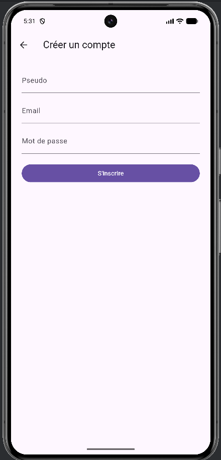

- login / joué en temps qu'invité

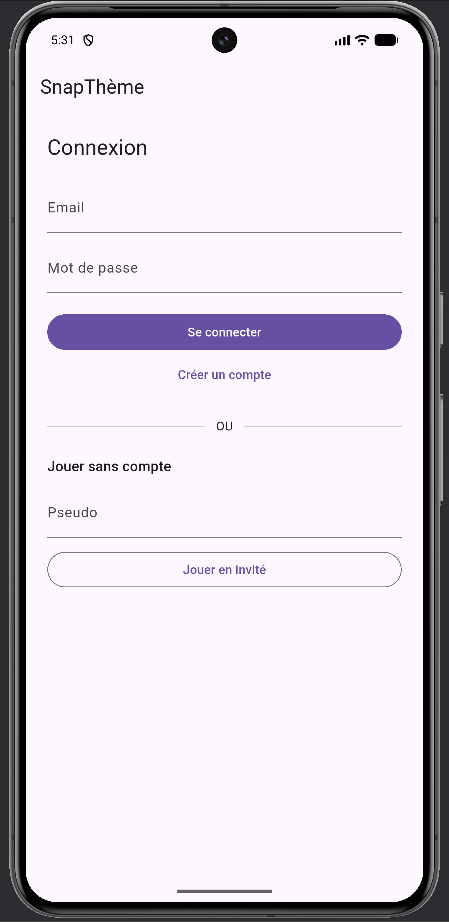

- home joueur 1 et 2

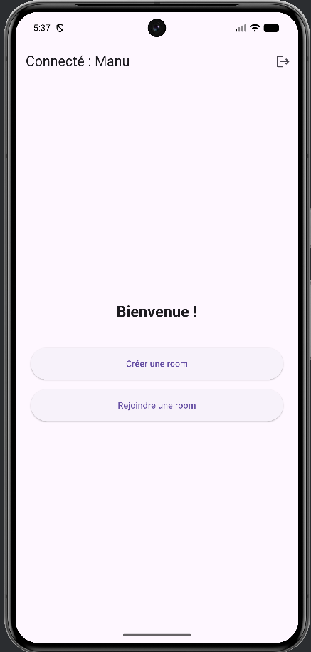

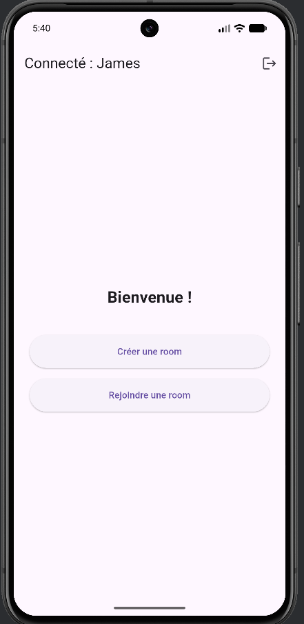

- création de room

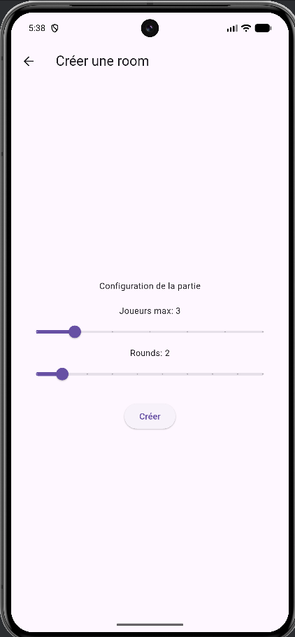

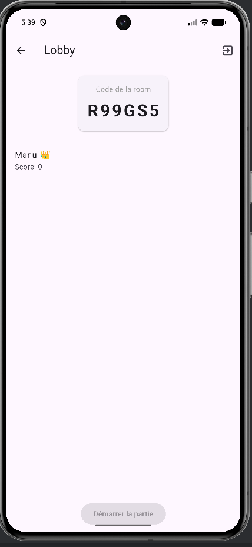

- joueur 2 rejoint la room

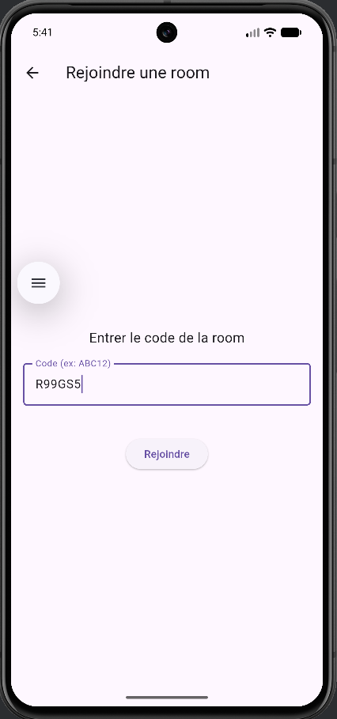

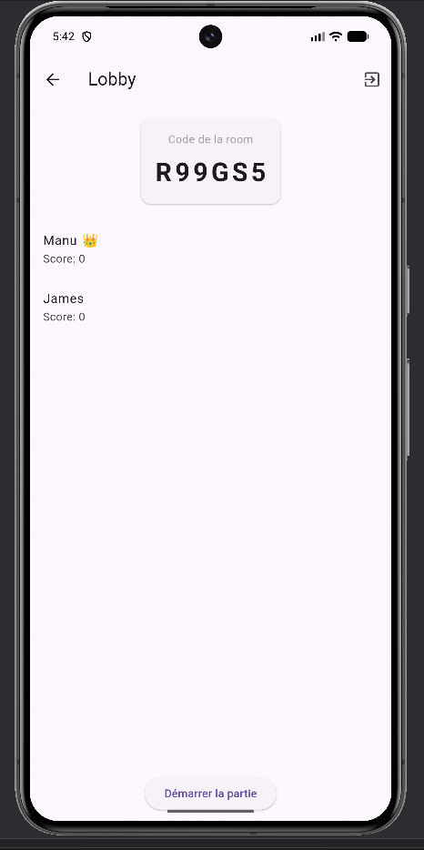

- Début partie

Choix du thème par le chef de la room

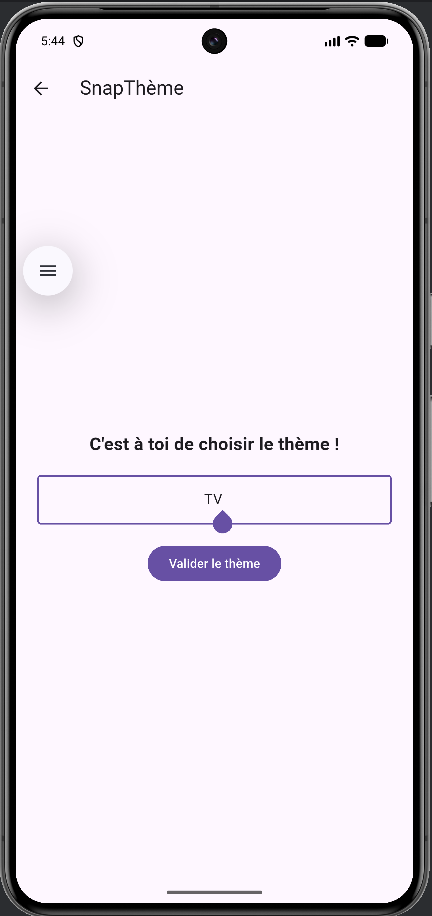

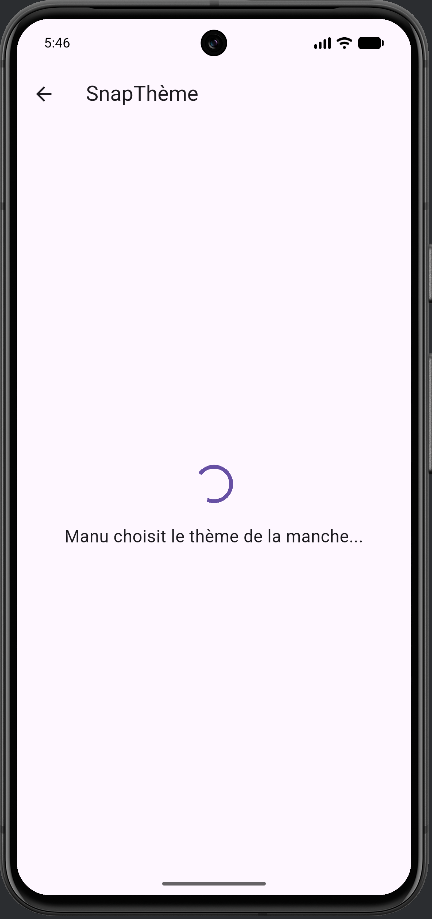

- Lancement du chrono et choix d'une image + authorisation

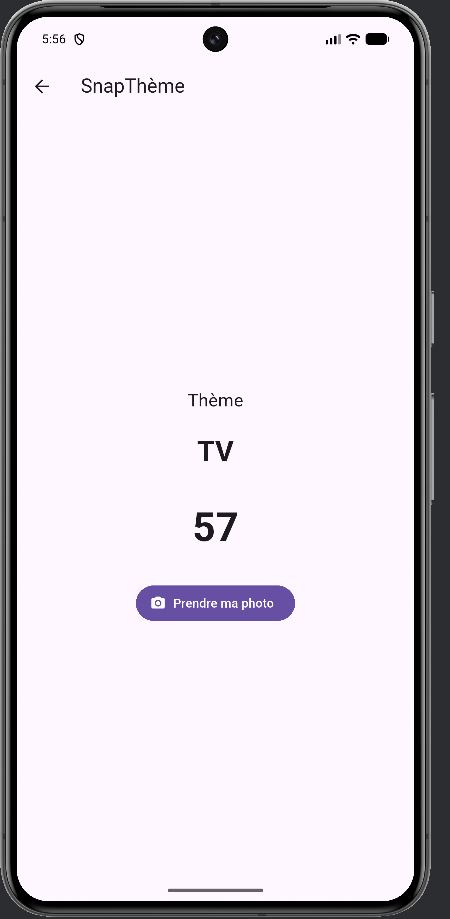

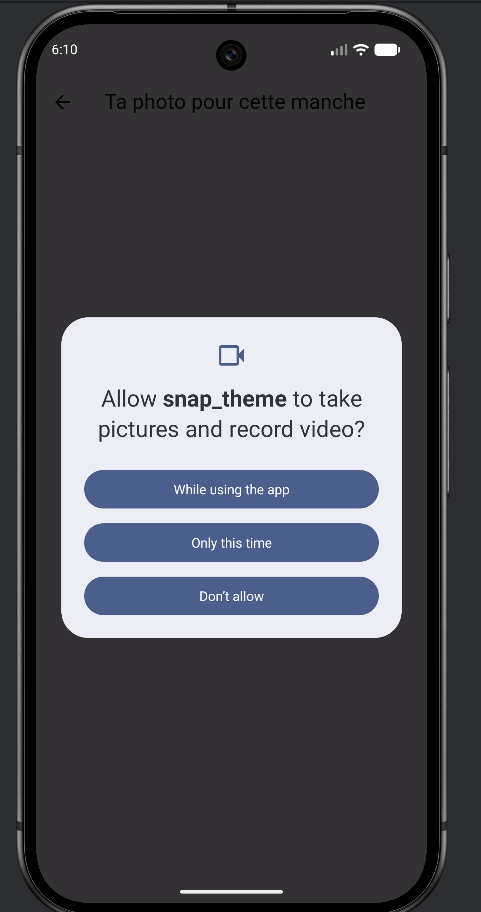

- Photo envoyé

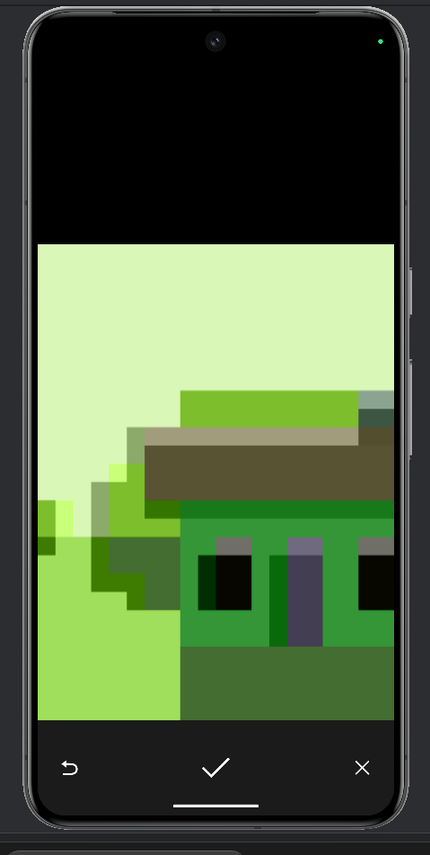

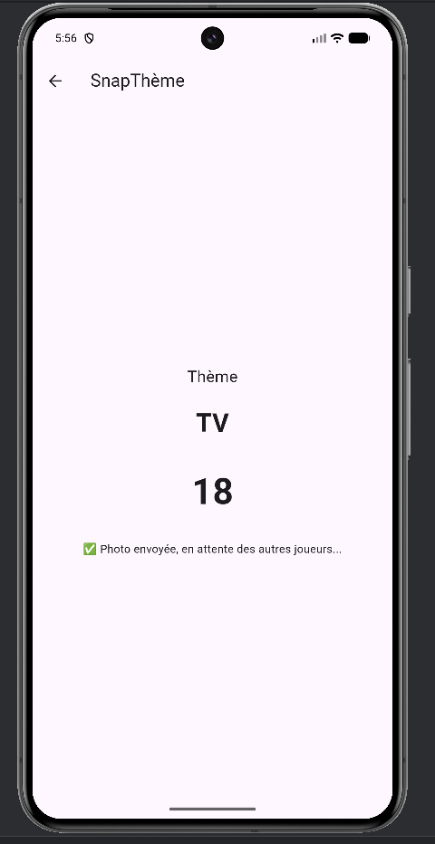

- Vote : affichage de la grille de photos et sélection d’un vote

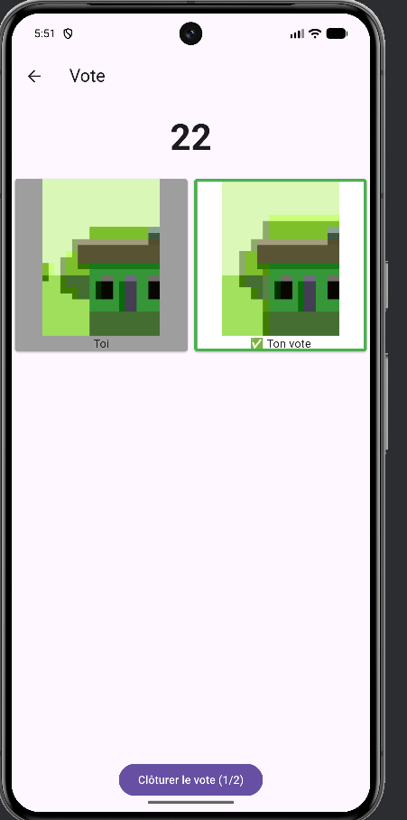

- Classement Manche 1

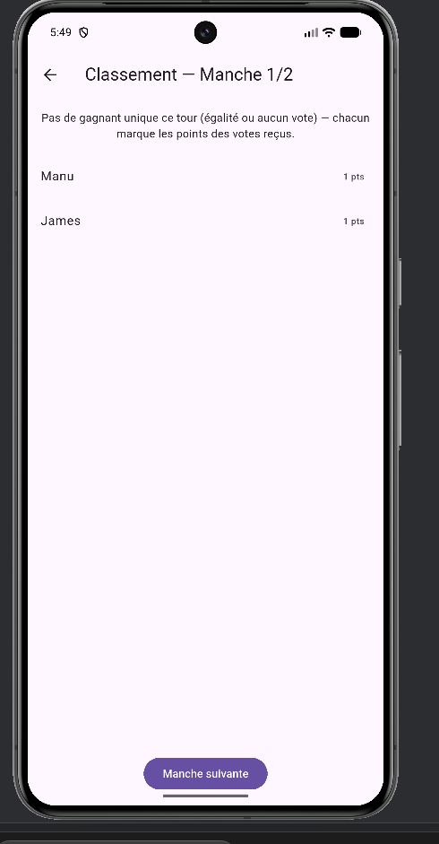

- Thème 2 (Début manche 2)

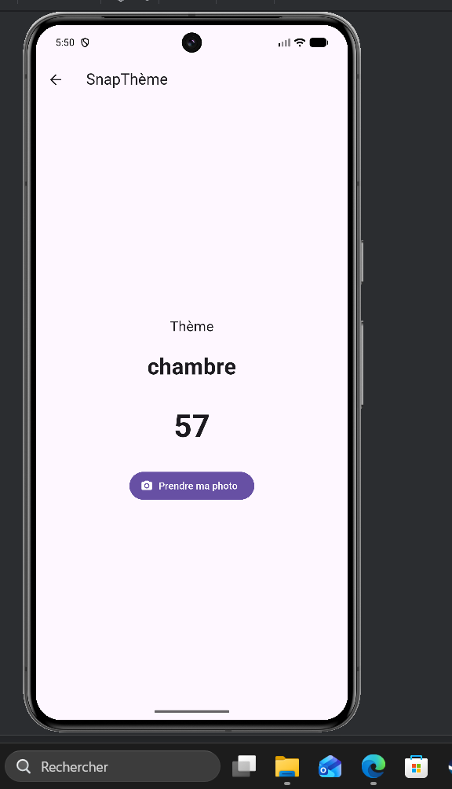

- Photo upload

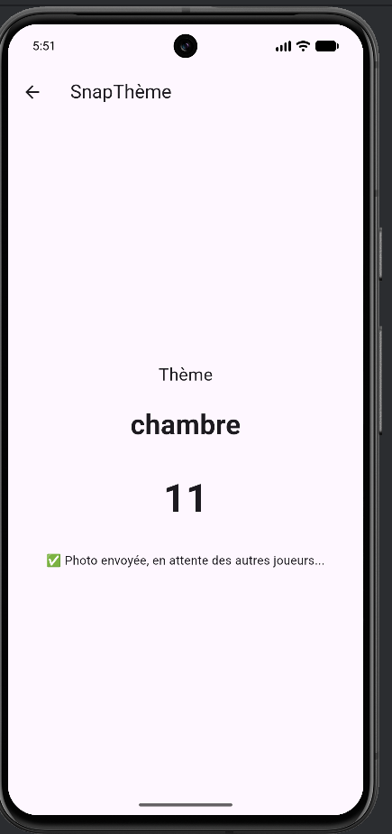

- Vote manche 2

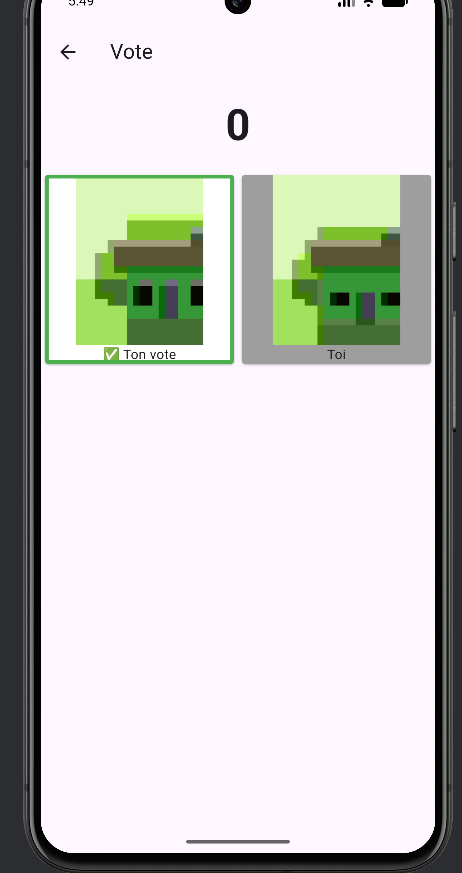

- Classement Manche 2

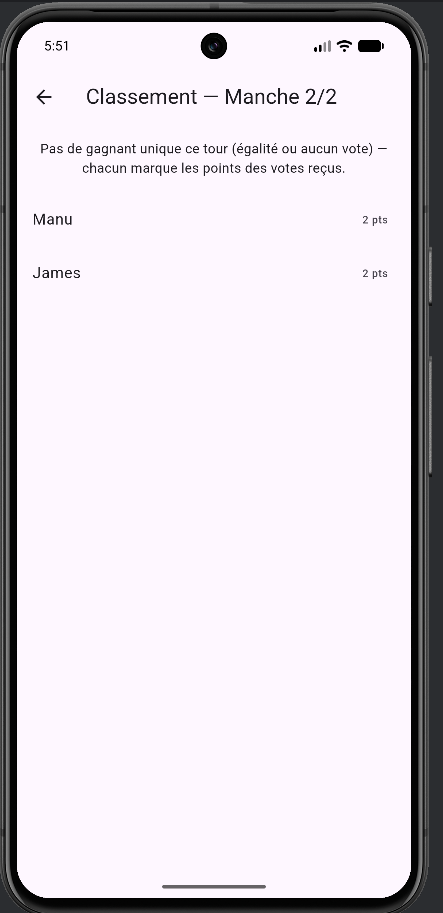

- Classement final

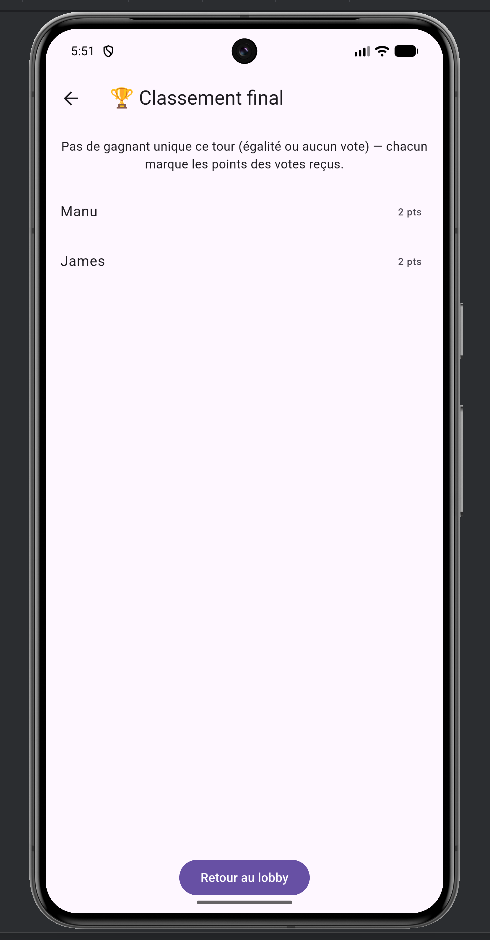


## Schéma Firestore

```text
rooms/{roomId}
├── code: string
├── hostId: string
├── status: string (waiting | theme | photo | vote | leaderboard | finished)
├── maxPlayers: number
├── currentRound: number
├── maxRound: number
├── gameStarted: boolean
│
├── players/{playerId}
│   ├── displayName: string
│   ├── joinedAt: Timestamp
│   ├── canCapture: boolean
│   ├── isSpectator: boolean
│   └── score: number
│
├── rounds/{roundNumber}
│   ├── theme: string
│   ├── status: string (theme | photo | vote | leaderboard)
│   ├── chooserId: string
│   ├── winnerId: string?   // optionnel
│   └── endsAt: Timestamp
│   └── submissions/{playerId}
│       ├── photoUrl: string
│       └── submittedAt: Timestamp
│
├── votes/{roundNumber}_{voterId}
│   ├── round: number
│   └── votedForPlayerId: string
│
└── users/{uid}   // collection complémentaire Auth
    ├── displayName: string
    ├── email: string?
    └── updatedAt: Timestamp
```

## Règles de sécurité 


```javascript
rules_version = '2';
service cloud.firestore {
  match /databases/{database}/documents {

    // Vérifie qu’un utilisateur est authentifié.
    function isSignedIn() {
      return request.auth != null;
    }

    // Vérifie qu’un utilisateur fait bien partie de la room.
    // On suppose que le joueur est listé dans /rooms/{roomId}/players/{uid}.
    function isMember(roomId) {
      return isSignedIn() && exists(/databases/$(database)/documents/rooms/$(roomId)/players/$(request.auth.uid));
    }

    // Les documents de room sont lisibles uniquement par les membres.
    match /rooms/{roomId} {
      allow read: if isMember(roomId);

      // Création possible uniquement si l’utilisateur authentifié est l’hôte.
      allow create: if isSignedIn() && request.auth.uid == request.resource.data.hostId;

      // Mise à jour autorisée aux membres de la room.
      allow update: if isMember(roomId);

      // Suppression désactivée par défaut.
      allow delete: if false;

      match /players/{playerId} {
        allow read: if isMember(roomId);
        allow create, update: if isMember(roomId) && (request.auth.uid == playerId || request.auth.uid == get(/databases/$(database)/documents/rooms/$(roomId)).data.hostId);
        allow delete: if false;
      }

      match /rounds/{roundId} {
        allow read: if isMember(roomId);
        allow create, update: if isMember(roomId);
        allow delete: if false;

        match /submissions/{playerId} {
          allow read: if isMember(roomId);
          allow create, update: if isMember(roomId) && request.auth.uid == playerId;
          allow delete: if false;
        }
      }

      match /votes/{voteId} {
        allow read: if isMember(roomId);
        allow create, update: if isMember(roomId);
        allow delete: if false;
      }
    }

    match /users/{userId} {
      allow read: if isSignedIn() && request.auth.uid == userId;
      allow create, update: if isSignedIn() && request.auth.uid == userId;
      allow delete: if false;
    }
  }
}
```


## Réflexion technique

### Synchronisation multijoueur

La synchronisation du jeu repose sur les `StreamBuilder` Firestore et les snapshots temps réel des documents de room, des joueurs, des rounds et des votes.


### Choix caméra / galerie / spectateur

Le flux capture est conçu pour être robuste :

- si la permission caméra est accordée : prise de photo directe
- si la permission est refusée : possibilité de continuer via la galerie
- si la caméra est indisponible : message d’erreur clair et fallback vers la galerie
- si l’utilisateur ne souhaite pas photographier : basculement en spectateur
